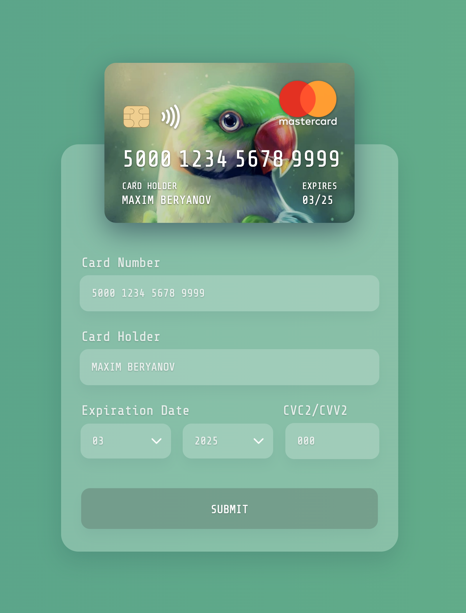
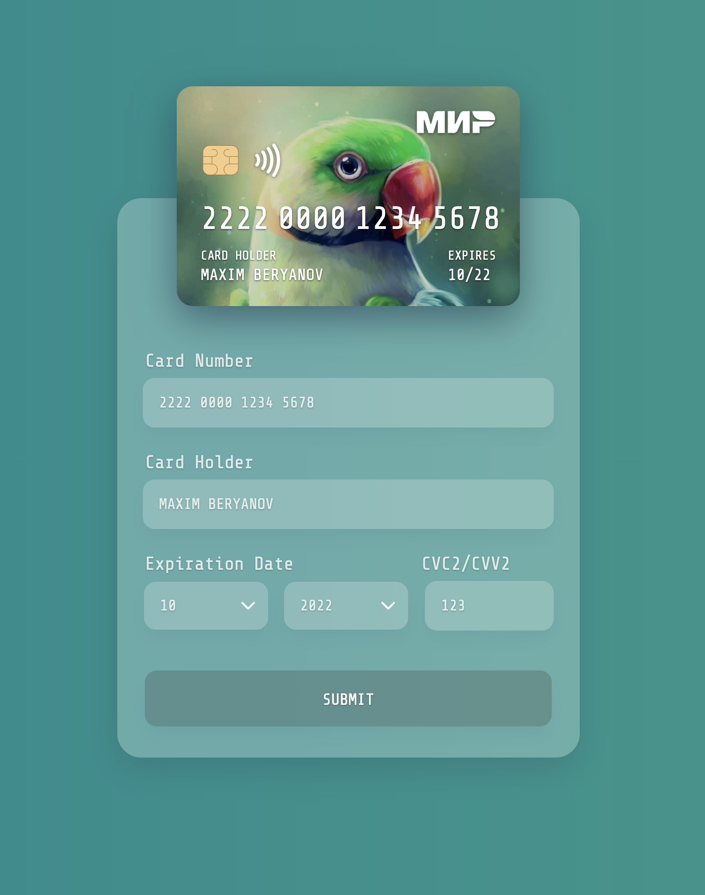
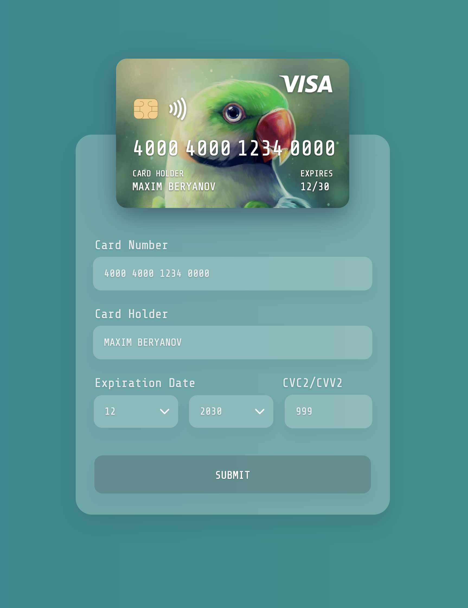
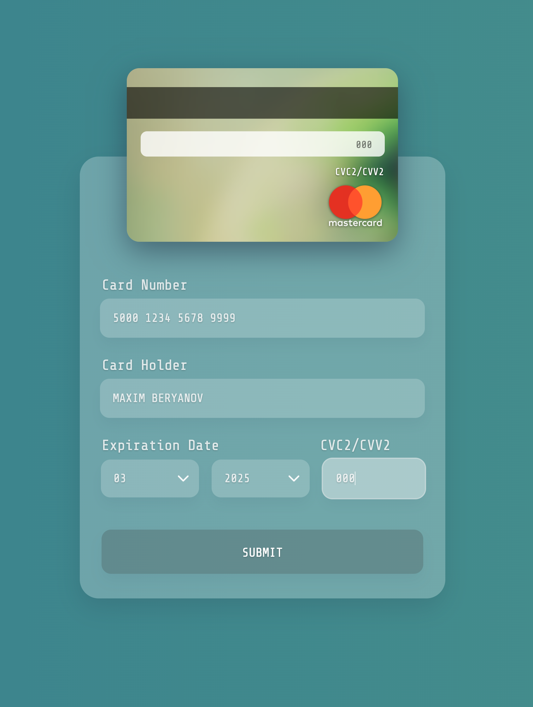
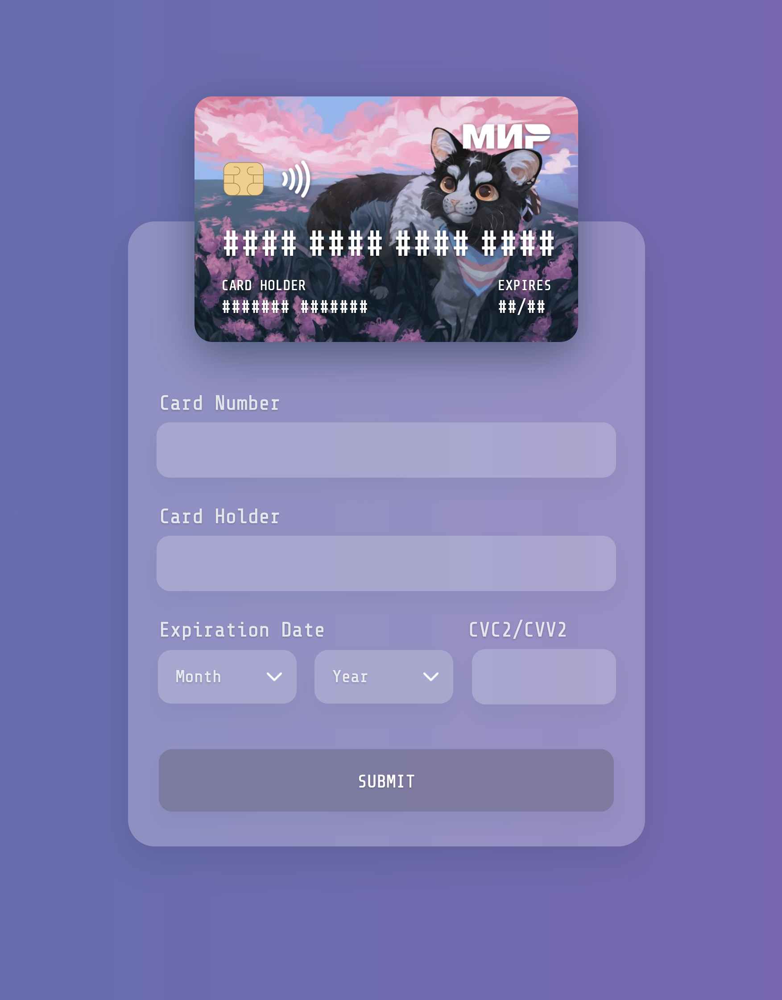
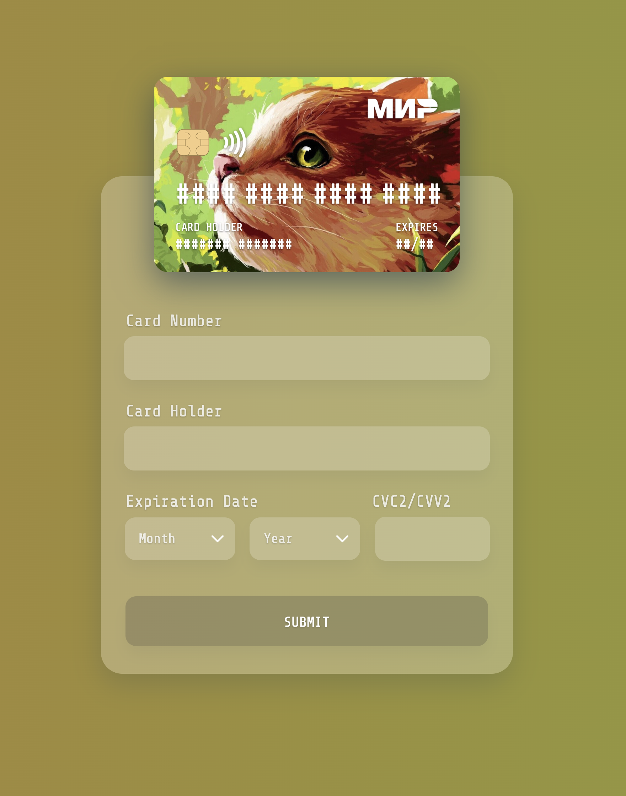
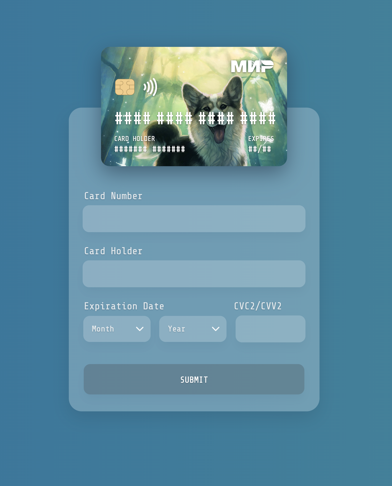

# Card Payment Form

This project was written in React.JS.

Below, you can see how it looks:

When entering field information, corresponding card zones also change with animated effect.

According to the card number entered, a payment system is adaptively chosen.

For example, Mir Payment System:

And Visa Payment System:

Other payment systems are ignored due to the "pet project" training purposes.

Moreover, when CVC2/CVV2 code is entered (the input zone is focused), the card flips with animation:

Also, by clicking at card itself, it is possible to change its cover. The cover also influences page background.

For example, here is the cat:

The kitty:

And the dog:

The page background is also animated.

